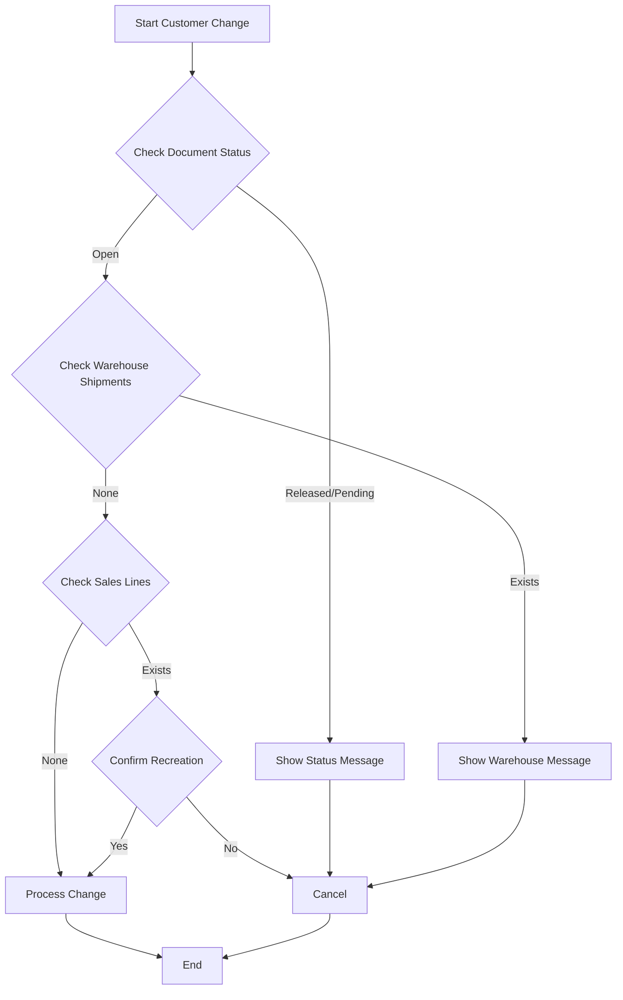

# Customer Change Validation Extension

## Overview
Enhances Business Central's customer change functionality with improved validation and user experience.
For suppressing the warning messages that appear when changing the Sell-to Customer and Bill-to Customer fields on sales documents in Business Central.

## Features
- Auto-confirm customer changes (configurable)
- Status validation
- Warehouse shipment validation
- Graceful error handling

## Setup
1. Open Sales & Receivables Setup
2. Set "Auto Confirm Customer Change" option

## Process Flow

## Technical Details
- Objects:
  - Table Ext 50100 "Sales & Receivables Setup Ext"
  - Page Ext 50100 "Sales & Receivables Setup Ext"
  - Codeunit 50550 "Sales Document Subscribers"
