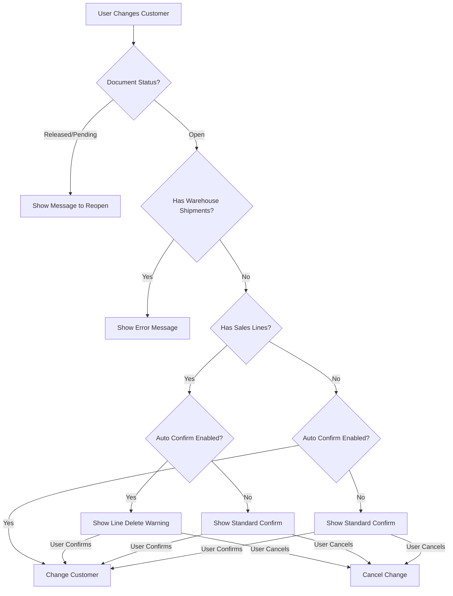

# Auto Confirm Customer Changes

Functionality to automatically confirm customer changes on sales documents with proper validation.

## Process Flow

## Setup

1. Open Sales & Receivables Setup
2. Enable "Auto Confirm Customer Change" toggle

## Validations

- Document must be in Open status
- No warehouse shipments can exist
- Sales line deletion warning if lines exist

## Error Messages

- Status error: "Document must be in Open status to modify..."
- Warehouse error: "Cannot change customer when warehouse shipments exist..."
- Line deletion warning: "If you change Sell-to Customer, the existing sales lines..."
